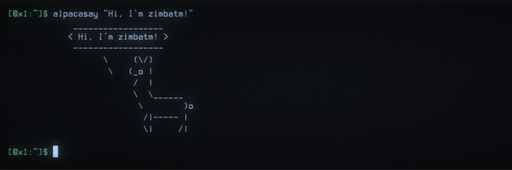

This website is my personal scratchpad. See [about](about.md) for more info on
the website.

## Posts

* [Recursive Nix experiment](experiment-recursive-nix)
* [Deploying Kubernetes apps with KubeNix](deploying-k8s-apps-with-kubenix)

## Current projects

* [BuiltWithNix](BuiltWithNix.md)
* [docker-nixpkgs](https://github.com/nix-community/docker-nixpkgs) - docker
  images straight out of nixpkgs
* [mdsh](https://github.com/zimbatm/mdsh) - markdown shell pre-processor
* [nix-path](https://github.com/zimbatm/nix-path) - per project NIX_PATH
* [terraform-nixos](https://github.com/tweag/terraform-nixos) - Deploy NixOS
  with Terraform

## Past projects

* Planning [NixCon](NixCon.md)

## Maintained projects

* [Hostnames and usernames to reserve](https://zimbatm.github.io/hostnames-and-usernames-to-reserve/)
* [direnv](https://direnv.net) - per directory environment variables
* [github-deploy](https://github.com/zimbatm/github-deploy) - Track deployments on GitHub PRs
* [h](https://github.com/zimbatm/h) - faster shell navigation of projects
* [logmail](https://github.com/zimbatm/logmail) - sendmail to syslog
* [nixbox](https://github.com/nix-community/nixbox) - NixOS Vagrant boxes
* [shab](https://github.com/zimbatm/shab) - full template engine in 4 lines of bash
* [socketmaster](https://github.com/zimbatm/socketmaster) - zero downtime services restarts 
* [more...](https://github.com/zimbatm?utf8=%E2%9C%93&tab=repositories&type=source)

## Journalling


* [{{ post.date | date: "%Y-%m-%d" }} - {{ post.title }}]({{ post.url | prepend: site.baseurl }})

